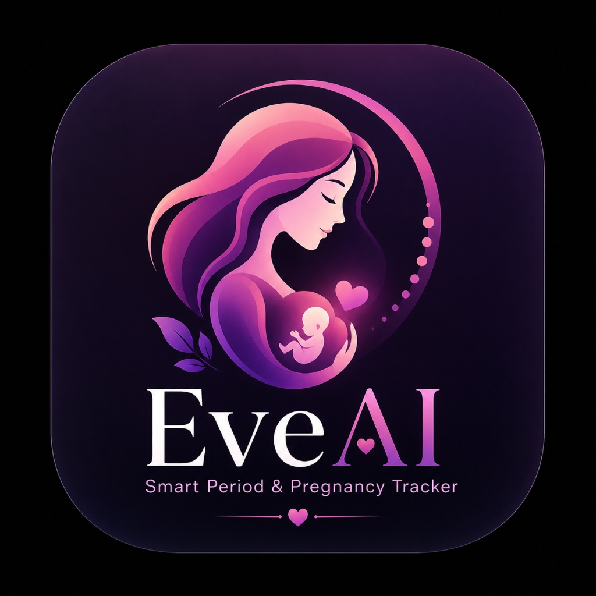
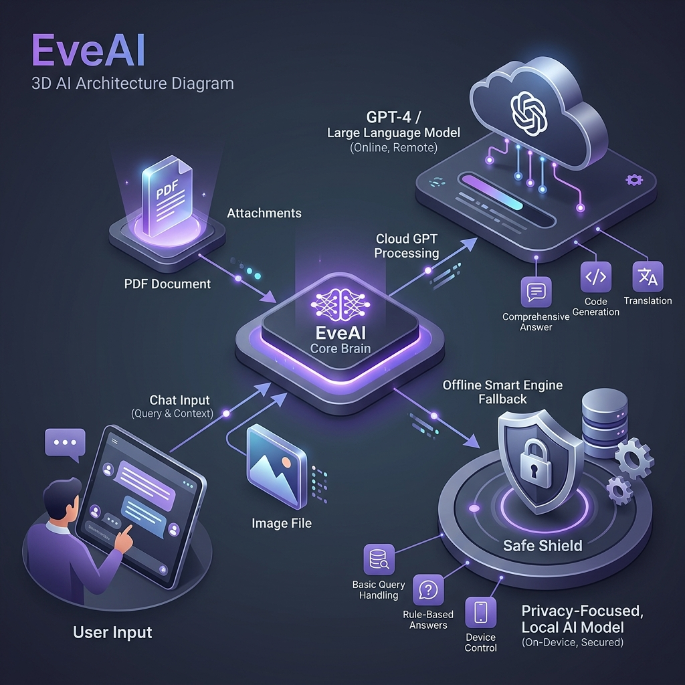
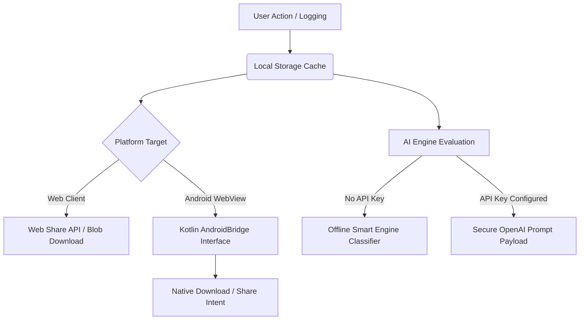

# <p align="center">✨ Introducing EveAI by ALoKX ✨</p>

<p align="center">
  <strong>A Next-Generation, Privacy-First AI Cycle Companion & Women's Health Tracker</strong>
</p>

<p align="center">
  
</p>

<div align="center">

[](https://alokxcreate.github.io/EveAI)
[](https://www.linkedin.com/in/alokkadam-ai)
[](mailto:alokkadam4214@gmail.com)

</div>

---

## 📌 Table of Contents
- [🌸 About EveAI](#-about-eveai)
- [📋 Features in Detail](#-features-in-detail)
- [⚙️ How It Works](#%EF%B8%8F-how-it-works)
- [🧠 AI & System Architecture](#-ai--system-architecture)
- [⭐ BEST Features](#-best-features)
- [📊 Core Feature Showcase](#-core-feature-showcase)
- [📂 Architecture & Directory Structure](#-architecture--directory-structure)
- [🛠️ Technical Specifications](#%EF%B8%8F-technical-specifications)
- [🚀 Deploying & Running Locally](#-deploying--running-locally)
- [👨‍💻 Developer & Project Author](#-developer--project-author)

---

## 🌸 About EveAI

EveAI is a premium, beautifully animated cycle companion designed to help track cycle forecasts, symptom trends, and pregnancy milestones. By combining advanced cloud intelligence with local smart processing, EveAI provides a complete picture of reproductive health. 

Unlike standard trackers, EveAI runs entirely client-side, storing all tracking data, mood logs, and AI conversation history securely inside local device storage. Whether you deploy it on the web or install the native Android APK, your data never leaves your device without your explicit consent.

---

## 📋 Features in Detail

*   **Smart Cycle Predictor**: Tracks and forecasts period start dates, ovulation windows, and fertility windows based on cycle statistics.
*   **Dual Tracking Modes**:
    *   *Standard Mode*: Focuses on daily logs, cycle forecasts, symptoms, moods, and energy levels.
    *   *Pregnancy Mode*: Switches trackers to gestational milestones, weekly progress alerts, and dedicated clinical indicators.
*   **Structured Logs Grid**: Interactive grids allowing users to log menstrual flow, basal body temperature (BBT), LH test strip readings, cervical mucus properties, and notes.
*   **Doctor Directory**: A dedicated contact workspace inside Settings to log your primary physician's details.
*   **Branded PDF Report Generator**: Compiles cycle metrics, daily logs, and predictions into a formatted, print-ready A4 PDF document.
*   **Excel Exporter**: Compiles history into a structured multi-sheet spreadsheet (`.xlsx`) with automated layouts.
*   **Premium AI Chat Workspace**: A floating interactive chat window with history caching, system templates, and file upload capabilities.
*   **Touch Performance Optimization**: Designed with custom CSS overrides to eliminate touch delay, remove default highlights, and disable animation stuttering on mobile processors.

---

## ⚙️ How It Works

Every action in EveAI is processed locally to keep user data private:

1.  **Data Capture**: Every logged symptom, temperature, and mood is written directly to the device's local database (`localStorage`).
2.  **Prediction Engine**: Calculations determine future cycle dates using average cycles, follicular length constants, and luteal offsets.
3.  **AI Classification**: When you drop an image or upload a document in chat, EveAI reads it as a Base64 data URL. If offline, the smart classifier scans the file properties and extracts information about test strips and clinical indicators. If online, it sends the file securely to OpenAI.
4.  **Doctor Communication**: If you save doctor details, the app displays active phone calls in a secure confirmation bottom sheet. Triggering the call uses the system dialer with pre-filled numbers.
5.  **Data Bridge**: Generated reports (PDF/Excel) are passed through the custom `AndroidBridge` interface inside the APK, triggering native sharing and downloads. On web browsers, they fall back to a web-based share dialog.

---

## 🧠 AI & System Architecture

Below is the conceptual architecture of the EveAI processing pipeline:

<p align="center">
  
</p>



---

## ⭐ BEST Features

### 🎨 3D Canvas Particle Splash Screen
When launching EveAI, a premium 3-second animated splash sequence greets the user. It is built using HTML5 Canvas rendering engine featuring real-time floating particles, gradient sweeps, logo glows, and text fade-in transitions.
*   **Implementation file**: [app.js](file:///C:/Users/Alok/Desktop/EveAI/app.js) & [styles.css](file:///C:/Users/Alok/Desktop/EveAI/styles.css)

### 📞 Native Dialer Doctor Call
Bypasses traditional web-browser blocks to trigger a secure mobile dialer intent immediately from the doctor configuration dashboard. 
*   **Implementation file**: [MainActivity.kt](file:///C:/Users/Alok/Desktop/EveAI/android-app/app/src/main/java/com/example/eveai/MainActivity.kt)
*   **Method**: Intercepts `tel:` protocols in the WebView Client and launches `Intent.ACTION_DIAL`.

### 📄 Pro PDF & Auto-Fit Excel Exports
Enables fully styled multi-sheet spreadsheet worksheets and vector PDF summaries designed for printing or direct clinical sharing.
*   **Implementation libraries**: `xlsx.full.min.js` and `jspdf.umd.min.js` loaded locally in assets.

### ⚡ Lag-Free Touch Overrides
To deliver a native application experience inside a WebView:
*   Disabled the default touch highlight color: `* { -webkit-tap-highlight-color: transparent; }`
*   Configured instant touch animations: Tapping cards triggers an immediate `scale(0.96)` tactile shift in `0.08s`.
*   Optimized GPU rendering: Disabled CPU-bound CSS filters like `backdrop-filter` on mobile viewports to prevent scrolling lag.

---

## 📊 Core Feature Showcase

| Feature | Description | Web Support | Android App Support |
| :--- | :--- | :---: | :---: |
| **Cycle Tracking** | Predictions, symptoms logging, and historical averages | ✅ | ✅ |
| **Pregnancy Mode** | UI adjustments, gestation milestones, progress cards | ✅ | ✅ |
| **Offline Smart AI** | Smart answers and document classification | ✅ | ✅ |
| **Premium GPT AI** | Secure OpenAI connection with conversation cache | ✅ | ✅ |
| **A4 PDF Export** | Custom styled medical summaries | ✅ (Web Download) | ✅ (System Download) |
| **Excel Export** | Multi-sheet workbook | ✅ (Web Download) | ✅ (System Download) |
| **Doctor Phone Call** | Confirmation overlay with direct system calling | ✅ (`tel:` link) | ✅ (Native Dialer) |
| **Native Share** | Sending reports to WhatsApp, Telegram, Gmail, etc. | ✅ (Web Fallback) | ✅ (System Share Sheet) |
| **Camera Uploads** | Take photos of reports directly in the app | ✅ (File Input) | ✅ (Native Camera Chooser) |

---

## 📂 Architecture & Directory Structure

```directory
EveAI/
│
├── android-app/                       # Kotlin Native Android Module
│   ├── app/
│   │   ├── src/main/
│   │   │   ├── assets/                # Local web app assets (synchronized)
│   │   │   │   ├── lib/               # SheetJS and jsPDF script libraries
│   │   │   │   ├── app.js             # Shared web application logic
│   │   │   │   ├── index.html         # Web client structural layout
│   │   │   │   └── styles.css         # Glassmorphic themes & overrides
│   │   │   ├── java/com/example/eveai/# Kotlin MainActivity & WebAppInterface
│   │   │   └── res/xml/file_paths.xml # Secure sharing paths for FileProvider
│   │   └── build.gradle.kts           # Module dependencies & SDK setup
│   └── build.gradle.kts               # Root Android build config
│
├── app.js                             # Web frontend application logic
├── index.html                         # Web frontend structural layout
├── styles.css                         # Web frontend glassmorphic styling
├── data.js                            # Default local datasets & variables
└── deploy.bat                         # Automated deploy utility script
```

---

## 🛠️ Technical Specifications

### Web Frontend Specs
*   **Architecture**: Single Page Application (SPA) built using pure ES6+ JavaScript.
*   **Libraries**:
    *   `xlsx.full.min.js`: Local SheetJS library for building Excel documents.
    *   `jspdf.umd.min.js`: Local jsPDF library for rendering A4 vector documents.

### Kotlin Android Wrapper Specs
*   **Target SDK**: 36 (Android 15+ compatible)
*   **Minimum SDK**: 24 (Compatible with Android Nougat 7.0 and up)
*   **System Permissions**:
    *   `android.permission.INTERNET`
    *   `android.permission.CAMERA`
    *   `android.permission.READ_MEDIA_IMAGES`
*   **WebView Configuration**: Enables Javascript, DomStorage, FileAccess, and binds a secure `FileProvider` (`com.example.eveai.fileprovider`) to allow cache sharing with other apps.

---

## 🚀 Deploying & Running Locally

### 🌐 Web Client Deployment
EveAI requires no server-side compilation or database services. 
1. **Direct Preview**: Double-click `index.html` to run the web interface directly in your browser.
2. **Automated Publishing**: To deploy instantly to public cloud services (Vercel or Netlify), execute the deployment helper script:
```bash
.\deploy.bat
```

### 📱 Android APK Compilation
To build the package yourself, make sure that **Java JDK 17** is configured in your system environment path.
```bash
# Navigate to the Android wrapper directory
cd android-app

# Compile a Debug Build
.\gradlew.bat clean assembleDebug
```
The compiled APK binary will be saved at:  
`android-app/app/build/outputs/apk/debug/app-debug.apk`

---

## 👨‍💻 Developer & Project Author

<div align="center">
  <table style="border: 2px solid rgba(168, 85, 247, 0.45); border-radius: 24px; background: rgba(19, 17, 28, 0.6); max-width: 600px; padding: 35px; border-collapse: separate; box-shadow: 0 15px 35px rgba(0, 0, 0, 0.45); margin-top: 20px; margin-bottom: 20px;">
    <tr>
      <td align="center" style="border: none; padding: 0;">
        
      </td>
    </tr>
    <tr>
      <td align="center" style="border: none; padding: 0;">
        <h2 style="color: #ffffff; margin: 0; font-family: 'Inter', sans-serif; border-bottom: none; font-size: 2rem; font-weight: 700; letter-spacing: -0.5px;">Alok Kadam</h2>
        <p style="color: #a855f7; font-weight: 700; margin: 8px 0 16px 0; font-size: 1.15rem; letter-spacing: 0.5px;">Software Engineer & AI Solutions Architect</p>
        <p style="color: #a1a1a8; font-size: 0.95rem; line-height: 1.6; max-width: 480px; margin: 0 auto 25px auto; font-family: 'Inter', sans-serif;">
          Hi! I'm Alok, a developer focused on designing software solutions that merge aesthetic design with practical utility. Feel free to connect with me for code collaborations, project inquirie, or support requests.
        </p>
        <div style="display: flex; gap: 10px; justify-content: center; flex-wrap: wrap;">
          <a href="https://github.com/AlokXCreate" target="_blank" style="text-decoration: none;">
            
          </a>
          <a href="https://www.linkedin.com/in/alokkadam-ai" target="_blank" style="text-decoration: none;">
            
          </a>
          <a href="mailto:alokkadam4214@gmail.com" target="_blank" style="text-decoration: none;">
            
          </a>
        </div>
      </td>
    </tr>
  </table>
</div>

---

## 📄 License & Contributions

*   **Contributions**: Bug fixes, feature proposals, and UI pull requests are welcome! Feel free to fork the repository, make changes, and open a Pull Request.
*   **License**: This project is licensed under the MIT License. You are free to modify, distribute, and build upon it.

---
<p align="center">
  <i>Made with 💖 for women's health empowerment.</i>
</p>


